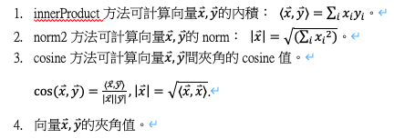

# Ruby's Java assignment

112.2【資管系】MI4204302 物件導向程式語言
吳幸儒 B11209002

<details>
     <summary>Homework 7</summary>

## Homework7

### 題目描述

請撰寫一個 Book 類別, 包含 String bookName, String isbn, Author authors[], Publisher publisher, Date publishingDate. Author 類別包含 String firstname 與 String lastname, Publisher 類別包含 String corp, String address. 撰寫 BookTest 類別建立兩個 Book 物件並印出其內容.

### 程式資料

- Access Point: /src/Homework7.java
- Book Class: /src/Model/hw07/Book.java
- Author Enum: /src/Model/hw07/Author.java
- Publisher Class: /src/Model/hw07/Publisher.java
- BookTest Class: /src/Model/hw07/test/BookTest.java

由於本次作業要求撰寫 BookTest 來測試 Book 與相關的依賴 ，故採用 junit 來測試，以便管理。

備註: junit 版本為 4.13.1，對應的 jar 檔案已經放在 /lib 資料夾下


</details>

<details>
     <summary>Homework 6</summary>

## Homework6

### 題目
請設計Date類別與Customer類別，Date類別包含int year,month,day，Customer類別包含String name, Sex sex, Date birthday, String phone，Sex為列舉(enum)型態，其可能值為MALE或FEMALE。撰寫CustomerTest類別，將文字檔customers.txt裡的資料讀入，每行轉換成Customer物件，並列印出來。

### 測試資料
customer.txt
```
Jack Lee,MALE,2000/01/04,0912345678
Jenny Huang,FEMALE,2000/03/05,0933333333
Brian Chen,MALE,2000/08/24,0922222111
Sophia Chou,FEMALE,2000/06/17,0933666333
```

### 程式資料
- Access Point: /src/Homework6.java
- Date Class: /src/Model/hw06/Date.java
- Sex Enum: /src/Model/hw06/Sex.java
- Customer Class: /src/Model/hw06/Customer.java
- CustomerTest Class: /src/Model/hw06/test/CustomerTest.java
- CustomerTest test data: /src/Model/hw06/test/customers.txt

</details>

<details>
     <summary>Homework 5</summary>

## Homework5

### 題目

請撰寫一個程式，能夠解析一個網址字串，將「網路協定(protocol)、主機名稱(host) 、路徑名稱(path)、檔案名稱(filename)、查詢資訊(query)」分別顯示出來。

注意事項：
1. 程式當中，一定要用到 indexOf() 與 substring() 這兩個方法。
2. 請以「 https://moodle2.ntust.edu.tw/course/view.php?id=1763#section-6 」這個字串作為範例，只需要將此網址正常判別即可。即無需做其它例外處理。

提示：
程式包含一個ParseUrl類別以及ParseTest測試類別。
```java
class ParseUrl {
     String protocol;
     String host;
     String path;
     String filename;
     String query;
     
     // 呼叫parse剖析結果放在protocol, host, filename, filetype
     public void parse(String urlString) { …}
     
         public String toString() { …}
}
     
class ParseTest {
     public static void main(String args[]) {
          ParseUrl parser = new ParseUrl();
          parser.parse(“https://moodle.ntust.edu.tw/course/view.php?id=19803”);
          System.out.println(parser);
    }
}
```

剖析結果例
```
protocol: https
host: moodle.ntust.edu.tw
path: /course/
filename: view.php
query: id=19803
```

### 程式資料
- Access Point: /src/Homework5.java
- ParseUrl Class: /src/Model/hw05/ParseUrl.java
- ParseTest Class: /src/Model/hw05/ParseTest.java
</details>

<details>
     <summary>Homework 4</summary>

## Homework4

### 題目

請創建類別Booking, Customer, 列舉型態Title.
撰寫BookingTest類別分別測試建立物件.
```java
import java.util.Date;

public class Booking{
     Customer customer;
     int numAdults, numKids;
     Date bookingTime;
     public Booking(…){…}
}

public enum Title {
    MR, MRS, MS
}

public class Customer {
     String surname;
     Title title;
     String phone;
     Public Customer(…) {}
}
```

由於本次作業要求撰寫 BookingTest 來測試 Booking 與 Customer 這兩個類是否正確，故採用 junit 來測試，以便管理。

備註: junit 版本為 4.13.1，對應的 jar 檔案已經放在 /lib 資料夾下


### 程式資料
- Access Point: /src/Homework4.java
- Booking Class: /src/Model/hw04/Booking.java
- Customer Class: /src/Model/hw04/Customer.java
- BookingTest Class: /src/Model/hw04/test/BookingTest.java

</details>

<details>
     <summary>Homework 3</summary>

## Homework3
### 題目

請定義兩陣列x,y代表兩向量x ⃑,y ⃑具有相同維度。
```java
double x[] = {….};
double y[] = {…};
```
並請定義三個方法，型態如下：
```java
static double innerProduct(double x[], double y[]);
static double norm2(double x[]);
static double cosine(double x[], double y[]);
```

方法實作可分別計算下列內容：



本次作業由於涉及矩陣運算，為求運算穩定、減少「造輪子」等行為，因此使用 weka.core.matrix 的相關方式來達成。
請務必將 /lib/weka.jar 中的檔案用作項目的依賴項。

以 IDEA 舉例：
1. 点击右上角 文件->项目结构->模块->依赖
2. 选择窗口右边的 ‘+’ 按钮，点击 ’JARs或目录‘ ，选择weka.jar文件，点击确定

### 程式資料
- 核心邏輯: /src/Model/VectorCalculator.java
- 測試範例(測試程式): /src/Homework3.java

</details>

<details>
     <summary>Homework 2</summary>

### 題目

程式一開始，會出現下列訊息，要求使用者輸入10位學生的成績。
```bash
請輸入10位同學的成績：
第1位：
第2位：
第3位：
第4位：
第5位：
…
第10位：
```

輸入完成後，程式根據輸入的成績，分別列出下列資訊：
```bash
第1位：
第2位：
第3位：
第4位：
第5位：
…
第10位：
分數介於90-100人數：OO人
分數介於80-89人數：OO人
分數介於70-79人數：OO人
分數介於60-69人數：OO人
分數介於0-59人數：OO人
```
</details>

<details>
     <summary>Homework 1</summary>

## Homework1

### 題目

請撰寫一類別Time包含hour, minute, second三個int欄位，並滿足以下條件，並自行撰寫測試類別TimeTest建立多個Time物件測試Time類別。
-	不同引數個數的建構式: Time(hh,mm,ss), Time(hh,mm), Time(hh)
-	toString()方法: 顯示為 hh:mm:ss格式
-	時分秒的get/set方法(需檢查傳入值的範圍) 方法
```java
int getHour()
int getMinute()
int getSecond()
void setHour(int hh)
void setMinute(int mm)
void setSecond(int ss)
boolean isMorning()
boolean isAfternoon()
boolean isNoon()
boolean isEvening()
```

### 程式資料

- Time 物件: /src/Model/Time.java
- TimeTest 物件: /src/TimeTest.java

### 實作功能
-	Time 物件不同引數個數的建構式: Time(hh,mm,ss), Time(hh,mm), Time(hh)
-	toString()方法: 顯示為 hh:mm:ss 格式(注意：12小時制)
-	時分秒的get/set方法(需檢查傳入值的範圍)
     int getHour(), int getMinute(), int getSecond(), void setHour(int hh), void setMinute(int mm), void setSecond(int ss)
-	boolean isMorning(), boolean isAfternoon(), boolean isNoon(), boolean isEvening()方法

### 時間定義

>#### 格式
> 名稱: 開始時(:分)(:秒) ~ 結束時(:分)(:秒)
- Morning: 0 ~ 12
- Afternoon: 12 ~ 18
- Evening: 18 ~ 20
- Noon: 12:00:00 ~ 12:00:00
</details>
